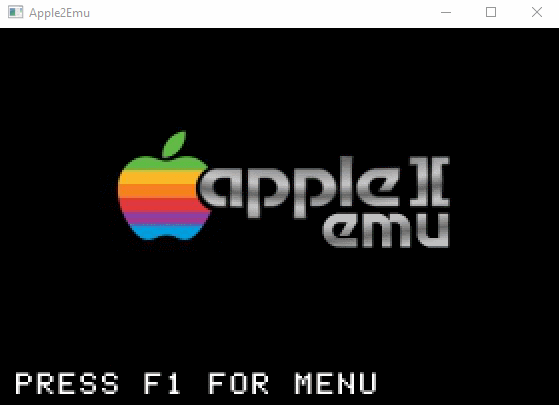
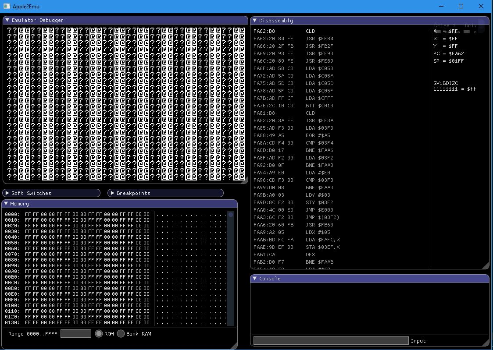

# Apple2Emu - An Apple ][ Emulator

Apple2Emu is an Apple ][ emulator.  Having started programming on the Apple ][ in the early 80's, I have always wanted to write an emulator for that system.  One goal for this emulator is to be cross platform (Windows, Mac OS, and Linux).  Given modern hardware, the need to write obfustaced code for the sake of speed is really not an issue anymore, so a second goal is to provide readable code that is more easily understood by someone looking to see how emulators can be built.  



# Required Libraries
The following external libraries are currently required to build apple2emu.
* [SDL 2.X](https://www.libsdl.org/) - For cross platform graphics, key, gamepad, handling
* [SDL Image 2.X](https://www.libsdl.org/projects/SDL_image/) - For loading texture images for fonts
* [ImGUI](https://github.com/ocornut/imgui) - currently included in apple2emu repo. Used for ingame menus. 
* [NativeFileDialog](https://github.com/mlabbe/nativefiledialog) - currently included in apple2emu repo.  Used for file selection dialogs
* [Glew](http://glew.sourceforge.net/) - GL Extension wrangler library.  Needed to provide runtime glue for application to host GL function calls.
* [Z80emu](https://github.com/anotherlin/z80emu) - Z80 emulation layer (for CP/M support).  This code is also included in apple2emu.
* [libclipboard](https://github.com/jtanx/libclipboard) - Cross platform clipboard handling.  This code is included in apple2emu.
* GTK+3.0 - Used by Native File Dialog (linux only)

## Building the emulator
Cmake is used to build the emulator on all platforms (including windows).  Due to the inclusion of other libraires in this code, using cmake for everything was the easiest way to get everything to compile properly.  Development has been typically done on windows using VS 2019, Visual Studio code, and even WSL.  All of these will build perfectly without problems.  All builds are generallly done with x86 targets (as there is no need for a 64 bit executable).  Depending on your environemnt, you will want to make sure that you choose the apporpriate generator with cmake.

### CMake
To build with Cmake, please do the following:

1. At your machines command line, change to the apple2emu directory
2. type 'mkdir build'
3. type 'cd build'
4. type 'cmake ..'
5. type 'make' (if you generated a makefile.  Note that cmake can build visual studio solutions and if you used cmake to build a visual studio solution, then open the solution with Visual studio and hit F7)

These steps should build the emulator as an executable named 'apple2emu' (or apple2emu.exe on windows). Note that a cmake build will copy provided disk and rom images into the build folder (along with required dlls).  

Cmake will attempt to find the required libraries: SDL2, SDL2_Image, and Glew.  If cmake cannot find any of these required libraries, an error will be produced in which case some hints may need to be given to cmake to find these libraries.  Cmake code has been provided to help properly locate these installations.

* To help cmake find your SDL2 installation, you can set the variable **SDL2_PATH** to point to the top level folder where SDL2 is located
* To help cmake find your SDL2_image installation, you can set the variable **SDL2_IMAGE_PATH** to point to the top level folder where SDL2_image is located
* If GLEW cannot be found, then you can set the variable **GLEW_PATH** to the top level fodler where Glew is installed.
  * ```cmake .. -DGLEW_ROOT=/path/to/glew-2.1.2 -DSDL2_PATH=/path/to/sdl2 -DSDL2_IMAGE_PATH=/path/to/sdl2_image```
  * For example:  ```cmake .. -DGLEW_ROOT=f:\projects\glew-1.13.0 -DSDL2_PATH=f:\projects\sdl2-2.0.12 -DSDL2_IMAGE_PATH=f:\projects\sdl2_image-2.0.5```
  
Debug builds can be made by defining the build type when running make:

```cmake -DCMAKE_BUILD_TYPE=Debug ..```

The executable will be named apple2emu_debug (note the \_debug extension on the executable)

Additionally for Windows, cmake will copy the needed SDL2 dll's from the SDL location to the emulator folder.

#### Visual Studio Code
Visual Studio Code can be used to build and run the emulator.  Start code in the top level apple2emu folder (i.e. run code . at the command prompt).  With the proper cmake tools installed, cmake will configure and build the project.  Note that on windows, you will have to start Visual Studio code from a command prompt that has the compiler and related executables in the path.  This action can generally be done by choosing the x86 Native Command prompt item in the Visual Studio menu items off your start menu.

#### Visual Studio
Use cmake to generate the solution file for Visual studio.  In general, you should not have to pass anything specific on the command line with cmake to get the solutions generated if it can find the compiler/IDE in your path.  Run ```cmake --help``` to see a list of generators that are availbale and choose the appropriate one.  The solution will be in the build folder and can be opened with the appropriate version of Visual Studio.  All of the library and include paths will be properly configured by cmake.

## Running the emulator
Run the emulator (either type apple2emu from the command line or hit F5 in visual studio).  You will be shown a splash screen and instructions to hit F1 to open the menu.  Hit F1 to bring up the menubar where you can set various options.  Specifcally, you will want to choose the machine emulation type and the disk to load in drive 1 (and possibly drive 2).  The F1 menu can also be used to control other features of the emulator such as emulator speed and color.

You will need to find disk images online that you can use in the emulator.  There are currently some great sources for images online:

* [Asimov] (ftp://ftp.apple.asimov.net/pub/apple_II/)
* [Apple 2 Online](http://apple2online.com/index.php?p=1_23_Software-Library)

You can use the above links to find disk images that are interesting to you.  Download and store them locally on your machine.  I have created my own folder called "disks" in the apple2emu folder where I store my images.  Use the Disk menu to mount a disk into a disk drive and then you can boot the machine.  The emulation speed slider can be used to control how quickly the emulator operates.  

## Integrated 6502 Debugger

There is an integrated 6502 debugger in apple2emu.  Press F11 from within the emulator to start up the debugger.  The debugger can be opened from the splash screen or anytime that the emulator is running.  This screenshot shows the debugger after pressing F11 from the splash screen.



The upper left corner shows the apple \]\[ screen.  Below the apple \]\[ screen is a memory viewer, and below that is the console. On the upper right is the disassembly of the machine broken on the assembly line when you entered the debugger.  The disassembly view will show the soft switches, breakpoints, and register values of the 6502 CPU.  

Apple2emu uses imgui for all of the debugger interface.  This fact means that these windows can be moved, collapsed and resized.  Those changes should be saved and restored everytime you close and reopen Apple2emu.  Find a window layout that you like and it will stay that way.  Window layouts can be reset off the debugger menu, or by deleting the settings.ini file in the root project folder.

When focus is in the disassembly view, the following keys can be used:

* F5 - continue execution (within the debugger).  This key will start execution of the emulator (until a breakpoint is hit)
* F6 - Step over current instruction.  If the current line is a JSR, then this command will step over the JSR continuing to the next line of code
* F7 - Step into current instruction.  Basically the opposite of F6 as it will step into a subroutine.
* F9 - Toggle breakpoint on the current line.  Breakpoints will be highlighted in red (and can be seen in the breakpoints window).

In addition, commands can be typed in the console window:
* 'step' to single step when broken
* 'continue' to continue execution
* 'break'  to set read/write breakpoint on memory location
* 'enable'/'disable' to enable or disable break or watchpoints
* 'list' to list breakpoints
* 'delete' to delete break or watch points
* 'trace' to start a trace dump to file (could create metric ton of output)
* 'quit' quits the debugger and hides the debugger windows
* 'exit' exits the emulator


## License
Apple2Emu is covered under the MIT license.  A copy of this license is available in the same directory as this file under the name License.txt  

